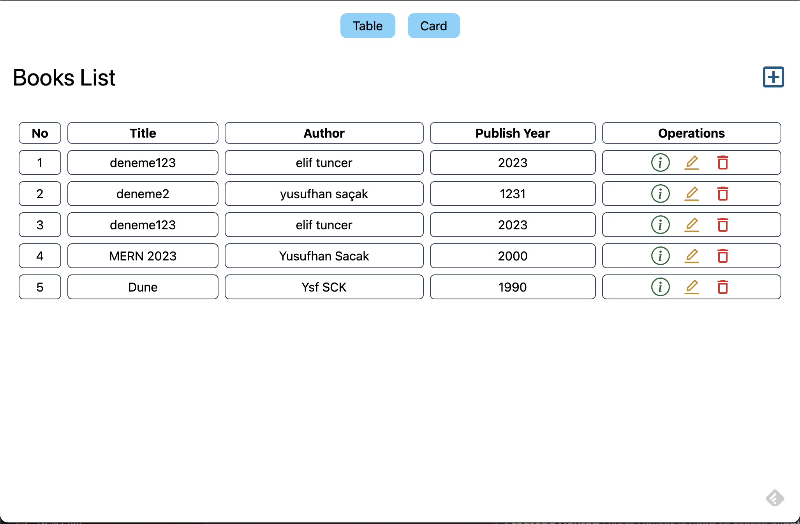
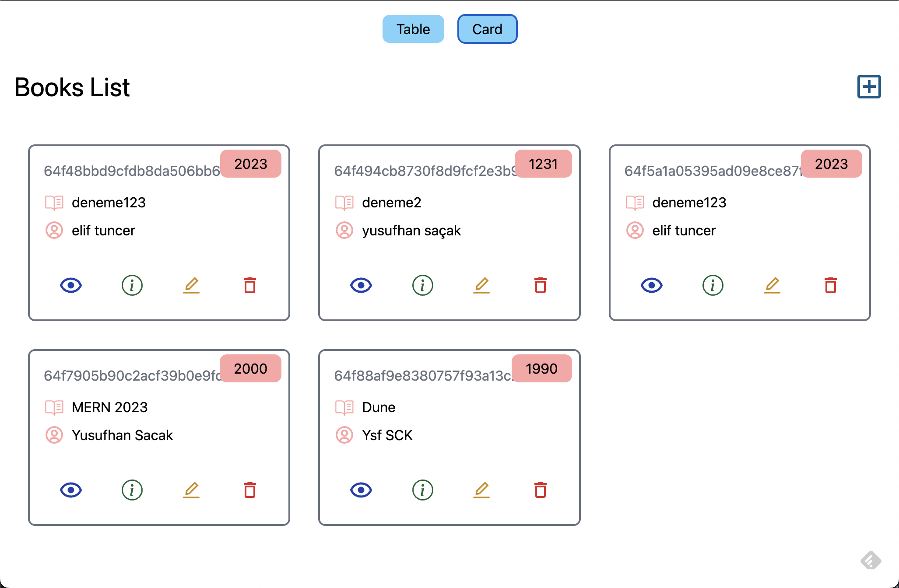
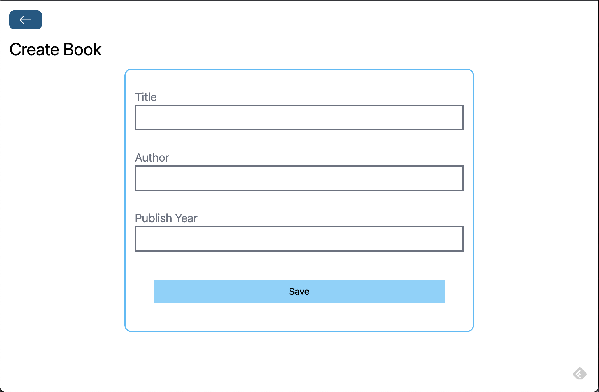
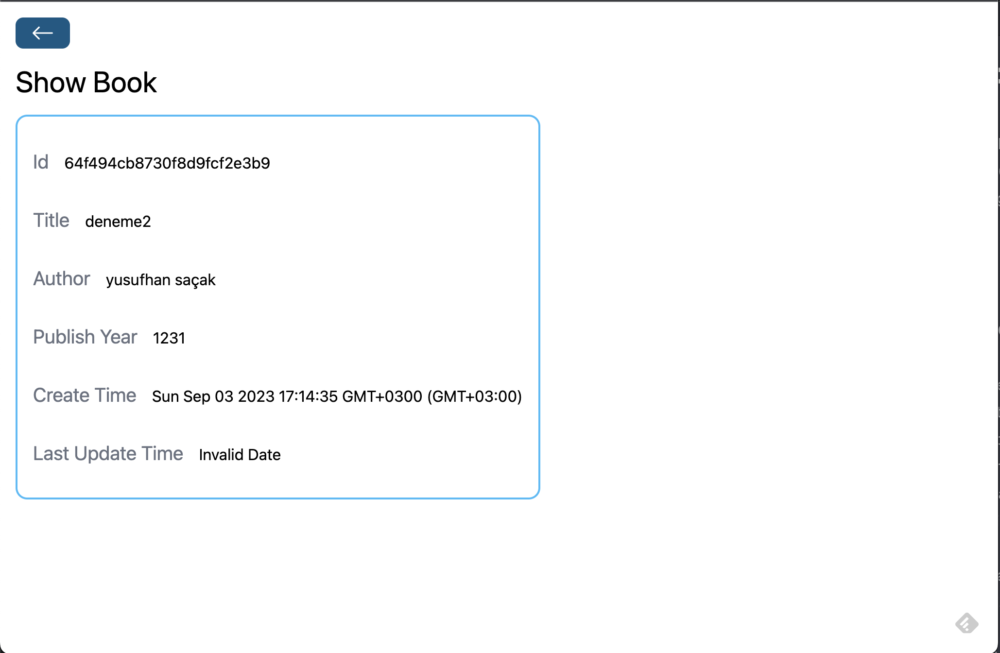
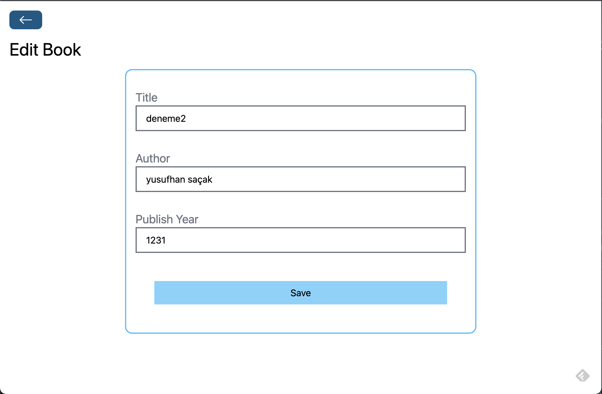
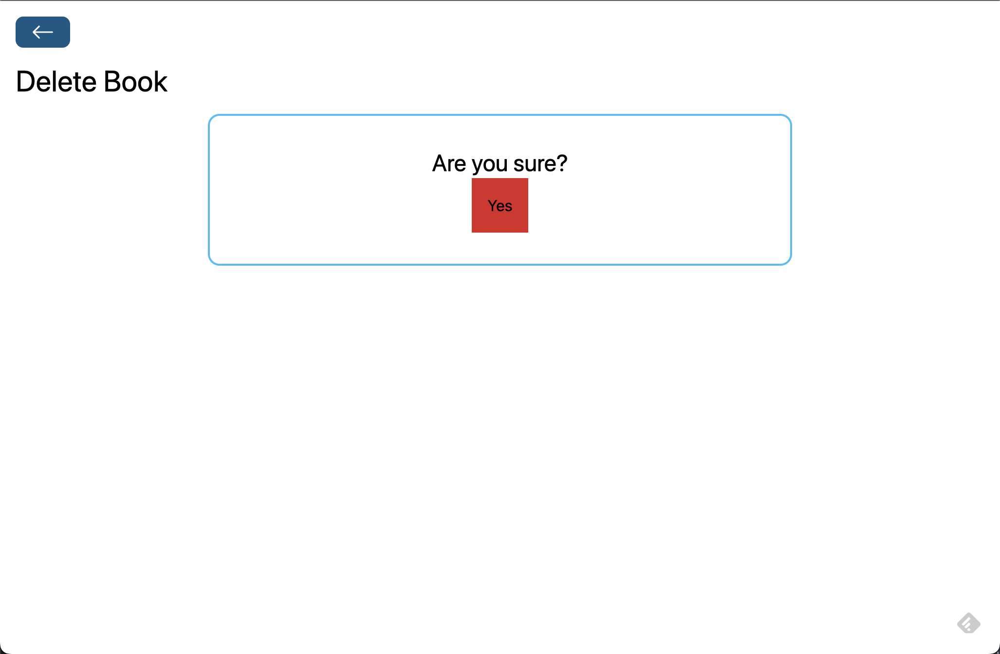

# Book Store Project (MERN Stack)


## Description

This is a simple Book Store Project built using the MERN (MongoDB, Express.js, React, and Node.js) stack. This project demonstrates basic CRUD (Create, Read, Update, Delete) operations on both the backend and frontend, including routing and CORS policy configuration.

Video Tutorial: https://www.youtube.com/watch?v=-42K44A1oMA&t=4s
## Features

- **Backend CRUD:** The backend of this project provides CRUD operations for managing books. You can create, read, update, and delete books using the API endpoints.
- **Backend Router:** Express.js is used to set up the backend routing. Each CRUD operation has its own route and controller for clean code separation.
- **CORS Policy:** Cross-Origin Resource Sharing (CORS) policy is configured to allow requests from the frontend to the backend, ensuring proper communication between the two.
- **MongoDB Operations:** MongoDB is used as the database for storing book information. The backend performs database operations such as creating, reading, updating, and deleting records.
- **Frontend CRUD:** The frontend of the project provides a user interface for performing CRUD operations on books. You can add new books, view existing books, edit book details, and delete books.
- **Frontend Router:** React Router is used to create client-side routing, allowing seamless navigation between different pages of the frontend application.

## Screenshots









## Getting Started

Follow the steps below to set up the project on your local machine and run it:

1. Clone the repository:

```bash
git clone https://github.com/JosephDoUrden/Book-Store-Project
cd book-store-project
```

2. Backend Setup:

```bash
cd backend
npm install
```

- Configure the MongoDB connection by creating a .env file with your MongoDB URI:
```
MONGODB_URI=mongodb://localhost:27017/bookstore
```

- Start the backend server:
```
npm run dev
```

3. Frontend Setup(new terminal):
```
cd frontend
npm install
npm run dev
```

## Technologies Used
### Backend:
- Node.js
- Express.js
- MongoDB

### Frontend:

- Vite
- React


## Contact

If you have any questions, feedback, or would like to connect, feel free to reach out to me.

- **Name:** Yusufhan Saçak
- **Email:** yusufhan.sacak@bahcesehir.edu.tr
- **Website:** https://medium.com/@yusufhansacak
- **Twitter:** [@0xSCK](https://twitter.com/0xSCK)
- **LinkedIn:** [Yusufhan Saçak](https://www.linkedin.com/in/yusufhansacak/)

Feel free to contact me through any of the channels above. I'm open to collaborations and discussions related to Flutter development or any other projects.
